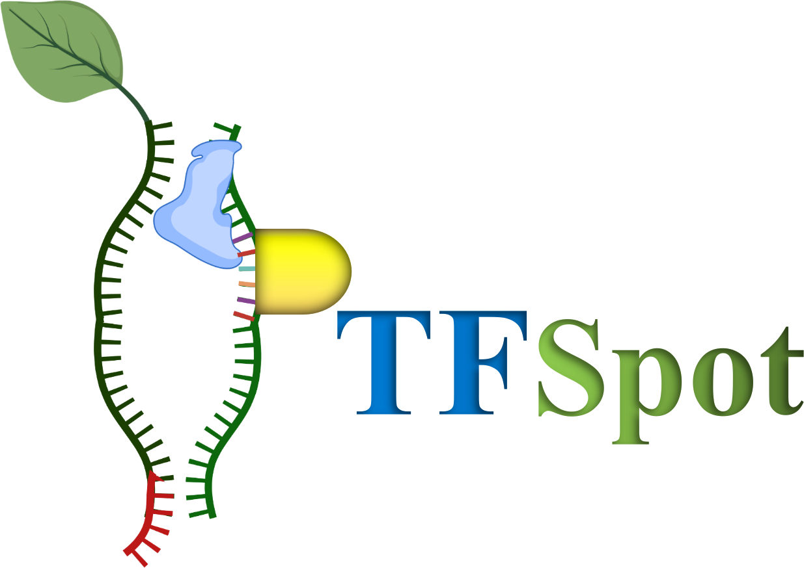

# PTFSpot

<p align="center">
  
</p>


## Description

<i><b>PTFSpot</b></i>: Deep co-learning algorithm to discover transcription factor binding site in plants

## Web server

PTFSpot can be used directly from [this](https://scbb.ihbt.res.in/PTFSpot) web server. This server implements trained models and can process both individual sequences or fasta files.

## Package installation

The latest version of the package can be downloaded from the GitHub [repository](https://github.com/SCBB-LAB/PTFSpot).
TFBS Models for Module 1 can be downloaded from [here](https://scbb.ihbt.res.in/PTFSpot/download.php).

## Requirements
```
1. Python3.6 or higher
2. python module Numpy, keras, tensorflow, plotly, pandas, bayesian-optimization
3. bedops
4. Bedtools
```

## File description
```
1. hyper_param.py = Python script build model implementing hyperparameter tuning
2. file_for_tuning: file containing label (0/1) and sequence (positive and negative instances). All in one line separated by tab for a single instance.
3. M1 = Module 1 execution script.
4. PTFSpot.py = Python script for detecting lncRNAs from sequences provided.
5. test = dummy fasta sequence for Module 1.
6. genomic_sequence = dummy fasta sequence for Module 2.
7. M2 = Module 2 execution script. (Sequence and PDB)
8. bimodal.h5  = Universal Transformer-DenseNet System.
9. pdbpar.py = pdb file parser
10. ptfspot.py = universal model script
```

## Note

Please place the downloaded model ("model.h5") in "model" folder (An example is provided).
Always place your TF pdb file in "pdb" folder (An example is provided).


## To build model implementing hyperparameter tuning

```
python3 hyper_param.py file_for_tuning

file_for_tuning: file containing label (0/1) and sequence (positive and negative instances). All in one line separated by tab for a single instance.
```

## Running script

To detect the TFBS, In parent directory execute following command:

Module 1: Identify TFBS only by providing sequence information in <i>Arabidopsis thaliana</i>
```
./M1 <fasta file> <TF> <folder path> <ChIP-Seq|DAP-Seq>
eg: ./M1 test ABF2 folderpath DAP-Seq
```

Module 2: Transformer-DenseNet system (identify TF regions within sequence with the corresponding TF protein structure)
```
unzip deeptfactor.zip
sh PTFSpot.sh <fasta file> <folder path> <PDB file> <folder path of PTFSpot>
eg: sh PTFSpot.sh genomic_sequence folderpath ABF2 /home/user/PTFSpot

To generate line plot, execute the following command:
python3 make-plot.py seq1.csv (filename) (generated plots are interactive)
```

==================
*Output description*
==================

TFBS detection module gives output in following format 

1. ABF1_predict = TFBS result for module 1
2. ABF1_genomic_sequence.txt = TF regions result for module 2


## Citation

Citation: Gupta S, Kesarwani V, Bhati U, Jyoti, Shankar R (2023) Deep co-learning on transcription factors and their binding sites attains impeccable universality in plants. bioRxiv 2023.
